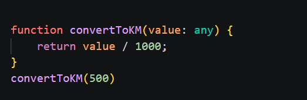
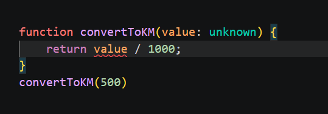
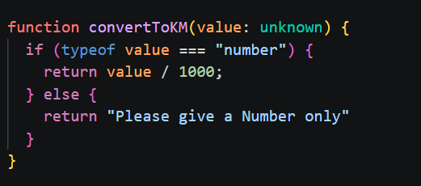
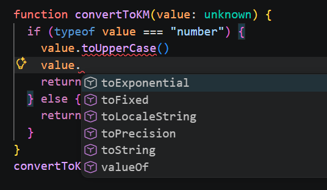

# টাইপস্ক্রিপ্টে ‍type: any এর তুলনায় unknown ব্যবহার করা কী বেশি নিরাপদ? Type Narrowing কী এবং কেন?

###

আজ আমরা আলোচনা করবো টাইপস্ক্রিপ্টের নিজস্ব দুইটি ডাটা টাইপ সম্পর্কে any এবং unknown। Type দুইটির মধ্যে মুল পার্থক্য কী এবং কোনটি ব্যবহার করা বেশি নিরাপদ এরং Type Narrowing বলতে কী বোঝায় এবং এর সুবধিা সম্পর্কে।

### মূল আলোচনা

আমারদের দৈনন্দিন জীবনে কোড করার সময় বিশেষ করে টাইপস্ক্রিপ্টে কোড করার সময় আমাদের প্রায় সময়ই ডাটা টাইপ নিয়ে ঝামেলায় পরতে হয়। কখনো কখনো আমাদের এমন ডাটা নিয়ে কাজ করতে হয় যা আগে থেকে অনুমান করা যায় না বা কোনো নির্দিষ্ট এক টাইপের হয় না ডাটা হয় না। মানে ডাটা কী `‍string`, `number` , `boolean` , ‍`array`, `object` নাকি অন্য কোন টাইপ? অনেক সময় আমাদের বিভিন্ন API ডাটা নিয়ে কাজ করতে হয় তখন অনেক সময় আমরা আগে থেকে জানতে পারি না যে ডাটাটা শুধু মাত্র স্ট্রিং ডাটাই হবে বা নির্দিষ্ট একটা টাইপের ডাটাই হবে? নাকি ভিন্ন ভিন্ন টাইপের ডাটা হবে। আবার ধরেন আপনি একটি `Meter to Kilometer Converter` ওয়েব অ্যাপ বানালেন যেখানে ইউজার যে সংখ্যাটা ইনপুট দিবে তা আপনি কিলোমিটারে কনভার্ট করে দেখিয়ে দেবেন। এখন কিছু ইউজার যদি ভুল করে Number এর সাথে ‍স্ট্রিং ভ্যালু যেমন 1500m দিয়ে দেয় তখন কী আপনার অ্যাপ ঠিক মতো আউটপুট দিতে পারবে? আপনার অ্যাপ কী ঠিক মতো রান করবে নাকি ক্র্যাশ করবে? আপনি যদি আপনার ফাংশনে রিটান ভ্যালু এবং ইনপুট ভ্যালু হিসেবে any দিয়ে রাখেন তখন কিন্তু টাইপস্ক্রিপ্ট আপনাকে কোনো এরর দিবে না এবং আপনি খুব ভালো করেই অ্যাপ বানিয়ে number দিয়ে রান করে হয়তো অ্যাপটি পাবলিশ করে দিলেন। এখন একজন ইউজার যখন 1500 এর জায়গায় 1500m দিয়ে দেবে তখন কিন্তু আপনার অ্যাপ ঠিক মতো আউপুট দিবে না এবং ক্র্যাশ করতে পারে। এখন আপনি যদি রানটাইমে গিয়ে সমস্যাটা দেখতে পান এবং সেটা পাবলিশ হয়ে যাওয়ার পর সমস্যাটি চোখে পরে তাহলে সেটা অবশ্যই আপনার জন্য বেশ বিরক্তিকর। যদি এররটা আপনার কোড করার সময়ই ধরা পরতো তখন কেমন হতো? আর সে জন্যই টাইপস্ক্রিপ্টে `unknown` type ব্যবহার করা হয় । কারণ আপনি যখন `unknown` টাইপ ব্যবহার করবেন তখন টাইপস্ক্রিপ্ট আপনাকে ফাংশনের লাজিক এমন ভাবেই লিখতে বাধ্য করবে যেন ইউজার যেমন ডাটাই ইনপুট দেক আপনার অ্যাপ ক্র্যাশ করবে না। আপনি চাইলেই ডাটাকে number মনে করে লজিক সাজিয়ে ফেলতে পারবেন না। টাইপস্কিট আগে আপনাকে দিয়ে টাইপ চেক করাবে , নিশ্চত হবে যে ডেটাটা েএসেছে সেটা number তারপর আপনাকে number সম্পর্কিত যত মেথড এবং `number` নিয়ে যত রকম কাজ করা যায় তা করতে দিবে। অনেক ক্ষণ বক বক করলাম এবার কোডের মাধ্যেমে বিষয়টা আরও ক্লিয়ার হওয়া যাক।

**কোড উদাহরণ: any কেন বিপজ্জনক?**

মনে করি আমাদের কনভার্টার ফাংশনটি এমন:

 **এখনে কোনো এরর নেই। এখানে` return value` এর নিচে কোনো লাল দাগ নেই। `value: any` ব্যবহারের কারণে টাইপস্ক্রিপ্ট কোনো বাধা দিচ্ছে না। value যদি stringও আসে তবুও সে রান হওয়ার চেষ্টা করবে এবং Output : `NaN` দিবে। ফলে অ্যাপ ক্র্যাশও করতে পারে।**

**Unknown type দিয়ে একই কোড:**

**Typescript return value এর নিচে লাল দাগ দিচ্ছে কারণ typescript বলতে চাচ্ছে , ভাই Value তো `unknown` type তাহলে তুমি কীভাবে না জেনে তাকে 1000 দিয়ে ভাগ করতে চাচ্ছো? Value তো `string`ও হতে পারে তখন তো ভাগ করা যাবে না। তাই আগে টাইপ ফিক্স করো তারপর সেই টাইপ অনুযায়ী কাজ করো। এখন আমরা কোড করার সময়ই সতর্ক হতে পারলাম যে এখানে যেকোনো টাইপের ডাটা আসতে পারে তাই একটা লাজিক বা type guard দিয়ে দিতে হবে এবং টাইপ অনুযয়ী কাজ করতে হবে। স্ট্রিং ভ্যালু আসলে `1000` দিয়ে ভাগ করা যাবে না।**

**_Safety Version :_**

**এখন টাইপস্ক্রিপ্ট বলছে যে ভাই Value যদি number type হয় তাহলে 1000 দিয়ে ‍ভাগ করা যাবে সমস্যা নাই। আর যদি অন্য যেকোনো টাইপ হয় তাহলে একটা ছোট্ট ম্যাসেজ দিয়ে দিব "Please give a Number only"। আমরা আগে typeof দিয়ে টাইপ নিশ্চিত হয়েছি তারপর সেই টাইপ অনুযায়ী লাজিক এপ্লাই করেছি। টািইপস্কিপ্ট এখন জানে কোন টাইপের ডাটার সাথে কেমন আচরণ করতে হবে। এখন এরর চলে গেছে। Typescriptও খুশি😊**

- আমরা বুঝতে পারলাম `any` ব্যবহার করা মানে হলে অন্ধের মতো কাজ করা এবং এর ফলে প্রজেক্ট বা কোডে যে কোনে সময় ভুল হতে পারে। আর এজন্য একে বলা হয় "type safety hole,"। আর `unknown` ব্যবহার মানে হলো জেনে বুঝে কাজ করা। আর টাইপস্ক্রিপ্টে `any` ব্যবহার করা মানে টাইপস্ক্রিপ্টের আসল সুবিধা থেকে বঞ্চিত হওয়া। আমি এখানে খুবই ছোট একটা ফাংশন দিয়ে বোঝানোর চেষ্টা করেছি। বাস্তবে এত ছোট কোডে হয়তো আমরা ভুল এরিয়ে যেতে পারবো বা `Worst Case scenario` চিন্তা করে আগে থেকেই লজিক ঠিক করে রাখতে পারবো কিন্তু যখন অনেক বড় প্রজেক্টে কাজ করা হবে এবং হাজার হাজার ডেটা থাকবে এবং অনেকজন ডেভেলোপার একটা প্রজেক্টে কাজ করবে এবং একাধিক ফাইল নিয়ে কাজ করবে তখন হয়তো কোন ফাংশন কোন টাইপের ডাটা ইনপুট নেয় এবং কোন টাইপের ডাটা আউটপুট দেয় তা মনে রেখে কোড করা খুবই কঠিন হয়ে পরবে এবং অন্য ডেভেলোপারের একটা ফাংশনের জন্য ভুল টাইপের ডাটা দিয়ে অন্য একটা ফাংশন লিখে রাখলে পরবর্তীতে অনেক বড় বড় বাগ তৈরি হতে পারে এবং যা পরবর্তীতে অনেক সময় নষ্ট করবে। তাই টাইপস্ক্রিপ্ট আমাদের জন্য unknown টাইপ নিয়ে আসছে যেন অনিশ্চিত টাইপের ডাটার সাথেও আমরা ভুল লজিক এবং ভুল মেথড দিতে না পারি। এটা আসলে ডেভলোপারদের অনেক বড় বড় বাগ থেকে বাঁচিয়ে দেয়।

## Type Narrowing: অনিশ্চিত ডাটাকে নিশ্চিত করা

আমরা এতক্ষণ **`unknown` type** এর ডাটার জন্য যে এক্সট্রা **typeof** ব্যবহার করে **value** এর টাইপ নিশ্চিত হলাম সেটাই হলো **Type Narrowing.** আমরা যখন এমন কোনো ডাটা নিয়ে কাজ করি যার টাইপ আমি নিশ্চিত না । যেকোনো টাইপের ডাটা আসতে পারে তখন আমরা **type Narrowing** করি। **type Narrowing** আলাদা কোনো টাইপ না। এটা আসলে একটা প্রক্রিয়ার নাম। যেমন আমরা যখন **type `unknown`** ভ্যালুকে **typeof === "number**" দিয়ে চেক করে নিলাম তখন এটাকেই বলে **type Narrowing** মানে এখানে অজানা টাইপকে আমরা একটা নির্দিষ্ট টাইপের জন্য কন্ডিশন দিলাম তখন টাইপস্ক্রিপ্ট বুঝে নিবে এই শর্তের সাথে যে ভ্যালু গুলো মিলে যাবে সেগুলো অবশ্যই **`number` type** হবে এবং তখন সে এই ভ্যালুগুলোর জন্য **`number` type** এর যত মেথড আছে তা ব্যবহার করতে দিবে এবং সাজেশনেও দেখাবে েএতে আমাদের কোড ভুল হওয়ার সম্ভবনা কম। সে কিন্তু তখন এই `number` টাইপের ভ্যালুর সাথে string method ব্যবহারকতে দিবে না। ডেভেলোপার যদি ভুল করে স্ট্রিং মেথড দিয়েও দেয় তখনই কিন্তু টাইপস্ক্রিপ্ট এরর দেবে। তাই অনিশ্চিত বা না জানা টাইপকেও একটি টাইপে নিয়ে আসা এবং সেই অনুযায়ী নির্ভুল কোড করার পদ্ধতিই হলো **Type Narrowing.**

**উদাহরণ:**

**এখানে দেখা যাচ্ছে যে আমারদের **value type `unknown`** থাকা সত্ত্বেও আমরা **if** ব্লক এর ভেতরে **value** এর সাথে **string method** ব্যবহার করতে পারছি না কারণ সে এখন **number type** হবে এটা নিশ্চিত কারণ আমরা বলেই দিয়েছি `if(typefo value === "number")` তার মানে এই শর্তে যা মিলে যাবে তারা `number` type হওয়ার করণেই এই ব্লকে ঢুকবে এবং তাহলে আর string method ব্যবহার করা যাবে না। এবং আমরা দেখছি টাইপস্ক্রিপ্ট আমাদের number method গুলোই সাজেস্ট করছে যখনই আমার `value.` (dot) দিচ্ছি। তারমানে টাইপস্ক্রিপ্ট এখন নিশ্চিত যে এটা `number` type data. যদিও ডাটাটা প্রথমে `unknown` ছিল কিন্তু এখন নিশ্চিত এই ব্লকের ভেতরে আমি nmuber tyep data ই পাবো।\_**
